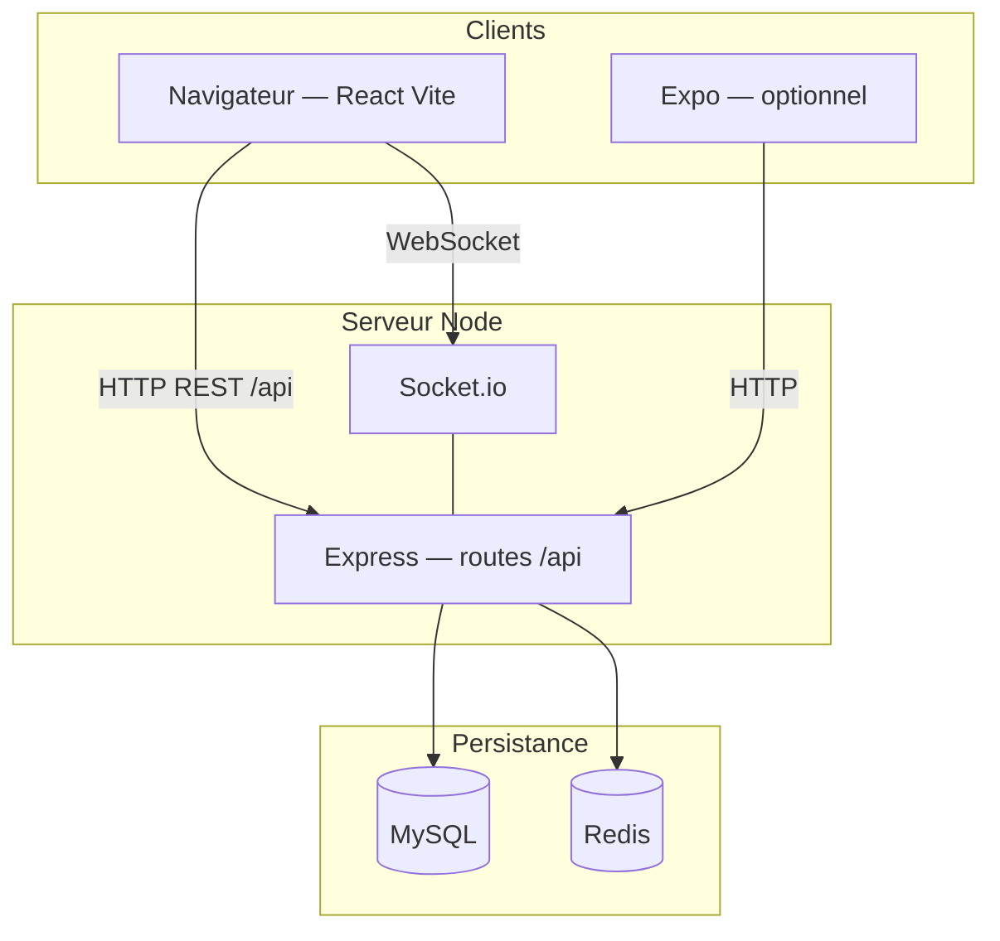

# OneLastEvent

Plateforme de gestion d’événements : création, publication et inscription à des événements gratuits ou payants, avec authentification par rôles (utilisateur, organisateur, administrateur).

Le dépôt regroupe une API **Node.js / Express**, une application web **React (Vite)** et, à part, un projet **Expo** (`MyEvenciaApp/`) pour une expérimentation mobile.


---

## Fonctionnalités

- **Authentification** — JWT avec rotation des jetons de rafraîchissement
- **Rôles** — `USER`, `ORGANIZER`, `ADMIN`
- **Événements** — Création, édition, publication et gestion
- **Inscriptions** — Événements gratuits ou payants
- **Paiements** — Simulation et intégration **Stripe** prête à l’emploi
- **Temps réel** — **Socket.io** pour les notifications
- **Interface** — SPA React responsive avec **Tailwind CSS**
- **API** — Spécification **OpenAPI / Swagger** (`backend/swagger.json`)

---

## Architecture

### Vue globale

L’application suit une architecture **client–serveur** : le navigateur exécute une SPA React qui dialogue avec une API REST sous le préfixe `/api`. Les données sont persistées dans **MySQL** ; **Redis** sert au cache et aux besoins de session selon la configuration. **Socket.io** fournit des canaux temps réel (notifications, salles par utilisateur ou par événement).



### Couches côté backend (`backend/src/`)

| Couche | Rôle |
|--------|------|
| **Routes** (`routes/`) | Chemins : `/auth`, `/users`, `/events`, `/inscriptions`, `/payments` |
| **Middlewares** (`middlewares/`) | JWT, rôles, validation, limitation de débit, erreurs |
| **Contrôleurs** (`controllers/`) | Adaptateurs HTTP vers les services |
| **Services** (`services/`) | Règles métier (auth, événements, inscriptions, paiements, utilisateurs) |
| **Repositories** (`repositories/`) | Accès aux données (Sequelize) |
| **Modèles** (`models/`) | Utilisateurs, événements, inscriptions, paiements |
| **Validators** (`validators/`) | Schémas **Joi** |
| **`server.js`** | Express, Helmet, CORS, `/api`, HTTP + Socket.io |

Le point d’entrée API est **`http://<hôte>:<port>/api`** (ex. `POST /api/auth/login`).

### Frontend (`frontend/src/`)

| Zone | Rôle |
|------|------|
| `App.jsx` / `main.jsx` | Routage et montage |
| `pages/` | Accueil, événements, tableaux de bord, profil, auth |
| `components/` | UI réutilisable (layout, cartes, pagination, modales) |
| `context/AuthContext.jsx` | Session et jetons |
| `services/` | **Axios** ; en dev, **Vite** proxifie `/api`, `/uploads`, `/socket.io` vers le port **4000** |

### Arborescence du dépôt

```
event-main/
├── backend/
│   ├── src/
│   │   ├── config/          # Base, Redis, logs
│   │   ├── controllers/
│   │   ├── middlewares/     # Auth, validation, erreurs
│   │   ├── models/
│   │   ├── repositories/
│   │   ├── routes/
│   │   ├── services/
│   │   ├── utils/
│   │   ├── validators/
│   │   └── server.js
│   ├── Dockerfile
│   ├── swagger.json
│   └── postman_collection.json
├── frontend/
│   ├── src/
│   │   ├── components/
│   │   ├── context/
│   │   ├── pages/
│   │   ├── services/
│   │   ├── App.jsx
│   │   └── main.jsx
│   ├── Dockerfile
│   └── package.json
├── MyEvenciaApp/            # Expo (optionnel)
├── docker-compose.yml
├── docker-compose.prod.yml
├── docs/
└── README.md
```

Pour plus de détails (flux, mobile), voir **[`docs/README.md`](./docs/README.md)**.

---

## Installation

### Prérequis

| Outil | Remarque |
|-------|----------|
| **Node.js** | ≥ 18 |
| **npm** | (yarn / pnpm possibles) |
| **MySQL** | 8.x |
| **Redis** | local ou Docker |
| **Docker** | optionnel (`docker compose`) |

### Cloner le dépôt

```bash
git clone <url-du-depot>
cd event-main
```

### Backend

```bash
cd backend
npm install
cp .env.example .env
```

Configurer **`backend/.env`** (voir [Variables d’environnement](#variables-denvironnement)), puis :

```bash
npm run migrate
npm run seed
```

### Frontend web

```bash
cd ../frontend
npm install
```

En local, l’API est en général relative (`/api`) via le proxy Vite. Pour un frontend servi à part, définir **`VITE_API_URL`**.

### Option Docker

```bash
docker compose up -d --build
docker compose exec backend npm run migrate
docker compose exec backend npm run seed
```

MySQL est souvent exposé sur le port hôte **3307** (voir `docker-compose.yml`). Fournir notamment **`JWT_ACCESS_SECRET`** et **`JWT_REFRESH_SECRET`**.

---

## Variables d’environnement

Créer **`backend/.env`** (à partir de `.env.example`). Exemple minimal pour le développement local :

```env
NODE_ENV=development
PORT=4000
FRONTEND_URL=http://localhost:3000

DB_HOST=localhost
DB_PORT=3306
DB_USER=onevent_user
DB_PASS=changeme
DB_NAME=onelastevent_db

REDIS_HOST=localhost
REDIS_PORT=6379

JWT_ACCESS_SECRET=votre_secret_access
JWT_REFRESH_SECRET=votre_secret_refresh
JWT_ACCESS_EXP=15m
JWT_REFRESH_EXP=30d

# Optionnel — paiements
STRIPE_SECRET_KEY=sk_test_...
STRIPE_WEBHOOK_SECRET=whsec_...
```

En production : secrets JWT forts, CORS adapté au domaine, HTTPS, credentials base et Redis sécurisés.

---

## Lancement

### Développement local

1. Démarrer **MySQL** et **Redis**.
2. **Terminal 1 — backend** (`backend/`) : `npm run dev`  
   - API : `http://localhost:4000/api` — Santé : `GET /api/health`
3. **Terminal 2 — frontend** (`frontend/`) : `npm run dev`  
   - UI : `http://localhost:3000`

Mode API proche production : **`npm start`** dans `backend/`.

### Build frontend

```bash
cd frontend
npm run build
npm run preview
```

### Vérification

- `http://localhost:3000` + connexion avec les [identifiants de test](#identifiants-de-test)
- `http://localhost:4000/api/health` → statut `ok`

---

## Identifiants de test

Après **`npm run seed`** dans `backend/` :

| Rôle | E-mail | Mot de passe |
|------|--------|----------------|
| **Administrateur** | `admin@test.com` | `MotDePasse123!` |
| **Utilisateur** | `user@test.com` | `MotDePasse123!` |

Organisateur (seed) : `organizer1@example.com` / `Organizer1!`.

---

## Scripts disponibles

### Backend (`backend/`)

| Commande | Description |
|----------|-------------|
| `npm run dev` | Serveur de développement (rechargement) |
| `npm start` | Serveur production |
| `npm run migrate` | Migrations base de données |
| `npm run seed` | Données de démonstration |
| `npm test` | Tests (Jest) |
| `npm run lint` | ESLint |

### Frontend (`frontend/`)

| Commande | Description |
|----------|-------------|
| `npm run dev` | Serveur Vite |
| `npm run build` | Build production |
| `npm run preview` | Prévisualiser le build |
| `npm test` | Tests (Vitest) |
| `npm run lint` | ESLint |

---

## Documentation API

- **OpenAPI 3.0** : `backend/swagger.json`
- **Postman** : importer `backend/postman_collection.json`

### Principaux endpoints

**Authentification**

- `POST /api/auth/register` — Inscription  
- `POST /api/auth/login` — Connexion  
- `POST /api/auth/refresh` — Rafraîchir les jetons  
- `POST /api/auth/logout` — Déconnexion  

**Utilisateurs**

- `GET /api/users/me` — Profil courant  
- `PATCH /api/users/me` — Mise à jour  
- `GET /api/users/me/inscriptions` — Mes inscriptions  

**Événements**

- `GET /api/events` — Liste (filtres)  
- `GET /api/events/:id` — Détail  
- `POST /api/events` — Création (organisateur)  
- `PATCH /api/events/:id` — Mise à jour  
- `DELETE /api/events/:id` — Suppression  
- `POST /api/events/:id/publish` — Publication  
- `POST /api/events/:id/inscriptions` — S’inscrire  

**Paiements**

- `POST /api/events/:id/payments` — Initialiser un paiement  
- `POST /api/payments/:id/mock` — Paiement simulé  
- `POST /api/payments/webhook` — Webhook Stripe  

---

## Sécurité

- Jetons d’accès JWT (durée limitée) et rafraîchissement  
- Hachage des mots de passe (**bcrypt**)  
- **Rate limiting** sur les routes sensibles  
- En-têtes **Helmet**, **CORS** configuré avec `FRONTEND_URL`  
- Validation **Joi**, requêtes paramétrées via Sequelize  
- Invalidation des jetons à la déconnexion (selon implémentation)

---

## Tests

```bash
cd backend && npm test
cd frontend && npm test
```

CI : `.github/workflows/ci.yml`.

---

## Déploiement

```bash
cd frontend && npm run build
docker compose -f docker-compose.prod.yml build
docker compose -f docker-compose.prod.yml up -d
```

**Checklist** : secrets JWT forts, `NODE_ENV=production`, CORS/HTTPS, clés Stripe, sauvegardes base, monitoring des logs.

Guides complémentaires : `DEPLOYMENT.md`, `GUIDE_PRODUCTION.md`.

---

## Technologies utilisées

| Couche | Stack |
|--------|--------|
| **Backend** | Node.js (ES modules), Express, Sequelize, MySQL, Redis (ioredis), JWT, bcrypt, Joi, Socket.io, Stripe, Winston |
| **Frontend** | React 18, Vite, React Router v6, TanStack Query, Axios, Tailwind CSS, Headless UI, react-hot-toast, Socket.io client |
| **Mobile (optionnel)** | Expo (`MyEvenciaApp/`) |
| **DevOps** | Docker & Docker Compose, GitHub Actions, ESLint |

---

## Documentation et ressources

- Documentation détaillée : **[`docs/README.md`](./docs/README.md)**  
- Guide pas à pas : **`GUIDE_ETUDIANT.md`**  
- OpenAPI : `backend/swagger.json`  
- Postman : `backend/postman_collection.json`

---

## Contribuer

1. Fork du dépôt  
2. Branche : `git checkout -b feature/ma-fonctionnalite`  
3. Commits puis `git push`  
4. Ouvrir une **Pull Request**

---

## Licence

MIT.
