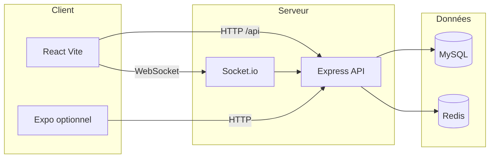

# Documentation OneLastEvent

Ce dossier complète le [README à la racine](../README.md) avec l’architecture, les flux principaux et les modalités de démarrage en détail.

## Table des matières

1. [Vue d’ensemble](#1-vue-densemble)
2. [Architecture technique](#2-architecture-technique)
3. [Démarrage détaillé](#3-démarrage-détaillé)
4. [Modèle de données et API](#4-modèle-de-données-et-api)
5. [Sécurité](#5-sécurité)
6. [Tests et qualité](#6-tests-et-qualité)
7. [Projet mobile (MyEvenciaApp)](#7-projet-mobile-myevenciaapp)

---

## 1. Vue d’ensemble

OneLastEvent est une application **client–serveur** :

- Le **navigateur** exécute une SPA React qui consomme l’API REST sous `/api`.
- Le **serveur** Express expose les routes, valide les entrées, applique l’authentification JWT et la logique métier (services + dépôts).
- **MySQL** persiste utilisateurs, événements, inscriptions et paiements.
- **Redis** est utilisé pour le cache / sessions selon la configuration.
- **Socket.io** permet des notifications temps réel (salles par utilisateur ou par événement).

---

## 2. Architecture technique

### 2.1 Backend (`backend/src/`)

Organisation en couches :

| Dossier | Rôle |
|---------|------|
| `config/` | Connexion Sequelize, Redis, logger Winston |
| `controllers/` | Adaptateurs HTTP : appellent les services |
| `services/` | Règles métier (auth, événements, inscriptions, paiements, utilisateurs) |
| `repositories/` | Accès données (abstraction au-dessus des modèles) |
| `models/` | Modèles Sequelize et schémas associés |
| `routes/` | Définition des chemins `/auth`, `/users`, `/events`, etc. |
| `middlewares/` | Auth JWT, rôles, validation Joi, rate limiting, erreurs |
| `validators/` | Schémas Joi par domaine |
| `utils/` | JWT, hash mot de passe, e-mail |
| `server.js` | Point d’entrée : Express, CORS, Helmet, montage des routes, serveur HTTP + Socket.io |

Le point d’API racine est **`/api`** (ex. `POST /api/auth/login`).

### 2.2 Frontend (`frontend/src/`)

| Élément | Rôle |
|---------|------|
| `App.jsx` + `main.jsx` | Routage et point de montage React |
| `pages/` | Écrans : accueil, liste/détail d’événements, création/édition, tableaux de bord, profil, auth |
| `components/` | UI réutilisable (layout, cartes, pagination, modales) |
| `context/AuthContext.jsx` | État de session et tokens |
| `services/*.js` | Appels Axios vers l’API (`api.js` configure le proxy `/api` en dev via Vite) |

En développement, **Vite** écoute sur le port **3000** et proxifie `/api`, `/uploads` et `/socket.io` vers **4000**.

### 2.3 Données principales

- **User** : rôles `USER`, `ORGANIZER`, `ADMIN`.
- **Event** : statuts (brouillon, publié, etc.), capacité, prix.
- **Inscription** : lien utilisateur–événement.
- **Payment** : enregistrement des paiements (fournisseur mock ou Stripe selon configuration).

---

## 3. Démarrage détaillé

### 3.1 Ordre recommandé (local sans Docker)

1. Démarrer **MySQL** et **Redis** sur la machine (ou conteneurs isolés).
2. Copier `backend/.env.example` vers `backend/.env` et renseigner au minimum :
   - `DB_*`, `REDIS_*`, `JWT_ACCESS_SECRET`, `JWT_REFRESH_SECRET`, `FRONTEND_URL` (ex. `http://localhost:3000`).
3. `cd backend && npm install && npm run migrate && npm run seed`
4. `npm run dev` dans `backend` (ou `npm start` pour un mode proche production).
5. `cd frontend && npm install && npm run dev`

### 3.2 Variables d’environnement frontend

Par défaut, l’URL API est relative (`VITE_API_URL` ou `/api`). En build Docker ou déploiement, définir `VITE_API_URL` vers l’URL publique de l’API si le frontend est servi sur un autre domaine que l’API.

### 3.3 Docker

Le fichier `docker-compose.yml` à la racine orchestre **mysql**, **redis**, **backend** et **frontend**. Les secrets JWT doivent être fournis (variables d’environnement). Après le premier démarrage, exécuter **migrate** et **seed** dans le conteneur backend (voir [README racine](../README.md)).

---

## 4. Modèle de données et API

### Endpoints principaux

- **Auth** : `POST /api/auth/register`, `POST /api/auth/login`, `POST /api/auth/refresh`, `POST /api/auth/logout`
- **Utilisateurs** : profil, inscriptions de l’utilisateur connecté
- **Événements** : CRUD (selon rôle), publication, inscriptions
- **Paiements** : initialisation et mock / webhook Stripe

La liste exhaustive et les corps de requête sont décrits dans **`backend/swagger.json`** et testables via **`backend/postman_collection.json`**.

### Identifiants de démonstration

Après `npm run seed` :

- Administrateur : `admin@test.com` / `MotDePasse123!`
- Utilisateur : `user@test.com` / `MotDePasse123!`

---

## 5. Sécurité

- Mots de passe hashés (bcrypt).
- JWT access + refresh ; déconnexion et rotation possibles selon implémentation des tokens.
- **Helmet**, **CORS** configuré avec `FRONTEND_URL`, **rate limiting** sur les routes API.
- Validation **Joi** des entrées ; requêtes paramétrées via Sequelize.

Pour la production : secrets forts, HTTPS, base et Redis sécurisés, pas de `alter: true` en sync Sequelize (migrations uniquement).

---

## 6. Tests et qualité

- **Backend** : `cd backend && npm test` (Jest + Supertest ; nécessite une base accessible si les tests d’intégration sont activés).
- **Frontend** : `cd frontend && npm test` (Vitest).

CI : voir `.github/workflows/ci.yml` pour le pipeline (lint, tests, build).

---

## 7. Projet mobile (MyEvenciaApp)

Le dossier **`MyEvenciaApp/`** contient une application **Expo** (structure typique `app/`, composants). Elle peut être branchée sur la même API en configurant l’URL de base dans le client API (`MyEvenciaApp/src/api/client.js`). Ce module est optionnel et indépendant du parcours web principal.

---

Pour les déploiements avancés (nginx, SSL, sauvegardes), consulter également `DEPLOYMENT.md` et `GUIDE_PRODUCTION.md` à la racine du dépôt.
